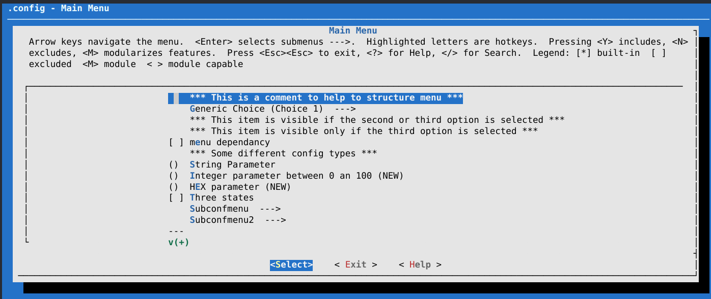
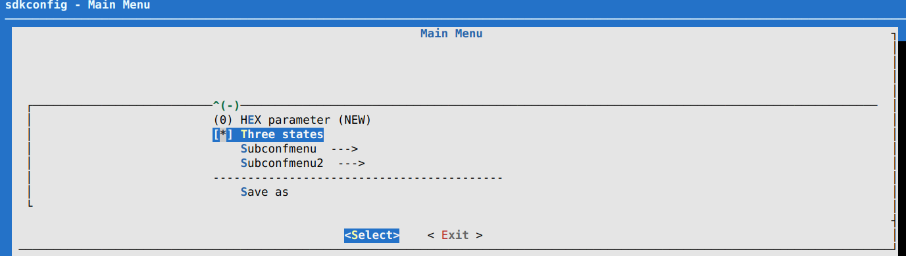

menuconfig++
============

**English** | [简体中文](README.md)

[](https://github.com/luskyle/menuconfig/actions/workflows/ci.yml)
[](https://github.com/luskyle/menuconfig/releases/latest)


A configuration tool built on the Linux kernel's `mconf`, reworked and extended.
It gives your project a menu UI for its build-time macros.

Project page: [https://luskyle.github.io/menuconfig/](https://luskyle.github.io/menuconfig/)



## Features

* Kernel-style TUI: arrow-key navigation, `<Y>`/`<N>`/`<M>` to toggle the highlighted entry, `?` or `< Help >` for help, `/` to search
* CJK-ready UI: links the wide-character `ncursesw`, and centers/truncates titles, menus and help windows by display width, so CJK entries neither misalign nor get sliced in half
* Full kconfig semantics: `bool` / `tristate` / `int` / `hex` / `string`, `choice`, `depends on`, `select`, nested submenus and `source` includes
* Generates `sdkconfig`, which CMake can read directly as compile definitions
* `conf` provides non-interactive modes (`--olddefconfig` / `--defconfig` / `--allyesconfig` and more) for scripts and CI

## Requirements

* A C compiler (gcc / clang)
* The ncurses development library — specifically its **wide-character build `ncursesw`**; the narrow library escapes every CJK byte into mangled `M-x` text

```bash
# Debian / Ubuntu
sudo apt install -y libncurses-dev
```

## Build and install

Building directly with CMake is recommended: no root, and it does not pollute the source tree.

```bash
cmake -S . -B build -G Ninja
cmake --build build
```

The artifacts are `build/mconf` (menu UI) and `build/conf` (command line).

The build type is controlled by two switches:

| Option                      | Effect                                                                 |
| --------------------------- | ---------------------------------------------------------------------- |
| none (default)              | `DEBUG=ON`, a Debug build with debug info                               |
| `-DDEBUG=OFF`               | a Release build (`-O3 -DNDEBUG`)                                        |
| `-DCMAKE_BUILD_TYPE=<type>` | an explicit build type; this always takes precedence                    |

The scripts shipped in the repo still work (they build in-tree):

```bash
sh build.sh     # clean + cmake + ninja
sh install.sh   # build, then copy mconf into /bin (needs write access there)
```

## Download

If you would rather not build it yourself, grab `menuconfig-<version>-linux-x86_64.tar.gz`
from [Releases](https://github.com/luskyle/menuconfig/releases/latest); it unpacks to the
`mconf` and `conf` executables.

## Testing

`mconf test/rootconf`

opens the CLI shown below:



Without a terminal you can use `conf` for a non-interactive smoke test:

```bash
conf --alldefconfig test/rootconf   # every symbol takes its default, writes sdkconfig
conf --allyesconfig test/rootconf   # every option is answered with yes
```

Run `conf --help` for the full list of modes:

| Option                                | Description                                                     |
| ------------------------------------- | --------------------------------------------------------------- |
| `--listnewconfig`                     | List new options                                                |
| `--oldaskconfig`                      | Start a new configuration using a line-oriented program         |
| `--oldconfig`                         | Update a configuration using a provided `.config` as base       |
| `--silentoldconfig <file>`            | Same as `oldconfig`, but quietly; write header to `<file>`      |
| `--olddefconfig` (`--oldnoconfig`)    | Same as `silentoldconfig` but sets new symbols to their default |
| `--defconfig <file>`                  | New config with default defined in `<file>`                     |
| `--savedefconfig <file>`              | Save the minimal current configuration to `<file>`              |
| `--allnoconfig`                       | New config where all options are answered with no               |
| `--allyesconfig`                      | New config where all options are answered with yes              |
| `--allmodconfig`                      | New config where all options are answered with mod              |
| `--alldefconfig`                      | New config with all symbols set to default                      |
| `--randconfig`                        | New config with random answer to all options                    |

## Reading the generated macros

The CMake snippet below reads `sdkconfig` and turns every `CONFIG_*` into a compile
definition (the comments and log messages inside it are in Chinese; it works as-is):

```cmake
# 读取文件内容
file(STRINGS sdkconfig lines NEWLINE_CONSUME)
# message(kconfig=${lines})


message("==========================读取配置文件==========================")

string(REGEX MATCHALL "(CONFIG[a-zA-Z_0-9]+)=([a-zA-Z0-9\"]+)" result ${lines})
message(${result})

message("==========================读取完毕,解析...==========================")

set(MATCHED_LINES "")
set(FLAGS "")
# 迭代处理每一行
foreach(line ${result})
    list(APPEND MATCHED_LINES ${line})
    # add_compile_definitions(${line})
    # string(REGEX MATCH "([a-zA-Z_0-9\"]+)" p ${line})
    string(REPLACE "\n" ";" pv ${line})
    string(REPLACE "=" ";" pv ${line})
    list(GET pv 0 p)
    list(GET pv 1 v)

    string(COMPARE EQUAL ${v} y equal)
    if(${equal})
        message(NOTICE ${p} \t\t ==> \t [选项是 y] \t ==> -D${p})
        add_compile_definitions(${p})
        set(${p} 1)
    else()
        message(NOTICE ${p} \t\t ==> \t [选项是 ${v}] \t ==> -D${line})
        add_compile_definitions(${line})
        set(${p} ${v})
    endif()
endforeach()

message("==========================配置文件解析完毕==========================")
```

## CI / CD

* `.github/workflows/ci.yml`: on pushes to `main` and on pull requests, builds a Debug / Release / `DEBUG=OFF` matrix, asserts the effective build type, then runs a non-interactive regression with `conf --alldefconfig`
* `.github/workflows/release.yml`: on a `v*` tag, builds Release, packages the binaries plus a sha256 file, and creates a GitHub Release
* `.github/workflows/pages.yml`: on pushes to `main`, publishes `docs/` to GitHub Pages

## TODO

* [x] Garbled CJK in displayed configuration — fixed in v0.1.0: the build now links the wide-character `ncursesw` and renders/centers/truncates by display width
* [ ] Input boxes (string parameters, `/` search, the `Save as` filename) should accept typing and editing CJK text

## License

* This repository: [LICENSE](LICENSE)
* Upstream stand-alone mconf: [LICENCE.txt](LICENCE.txt) (GPL-2.0+, Copyright © 2014 Andreas Löscher)